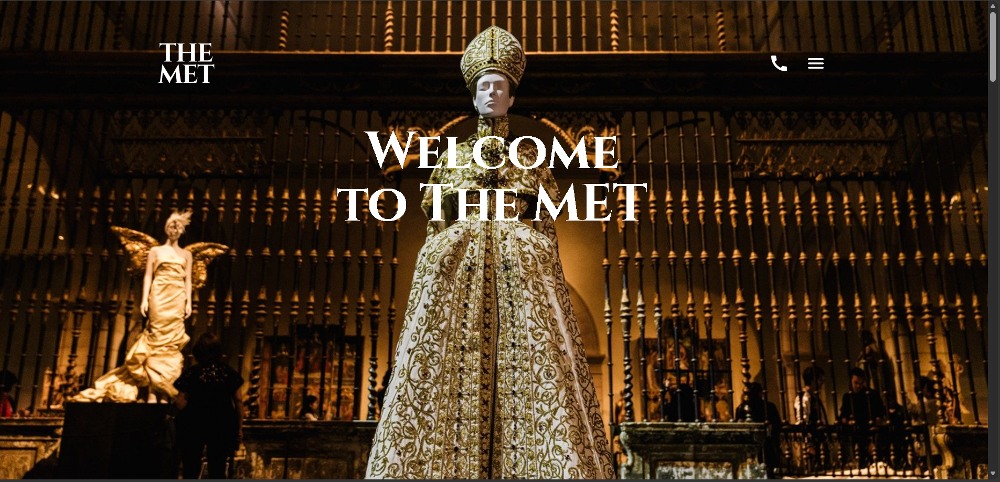
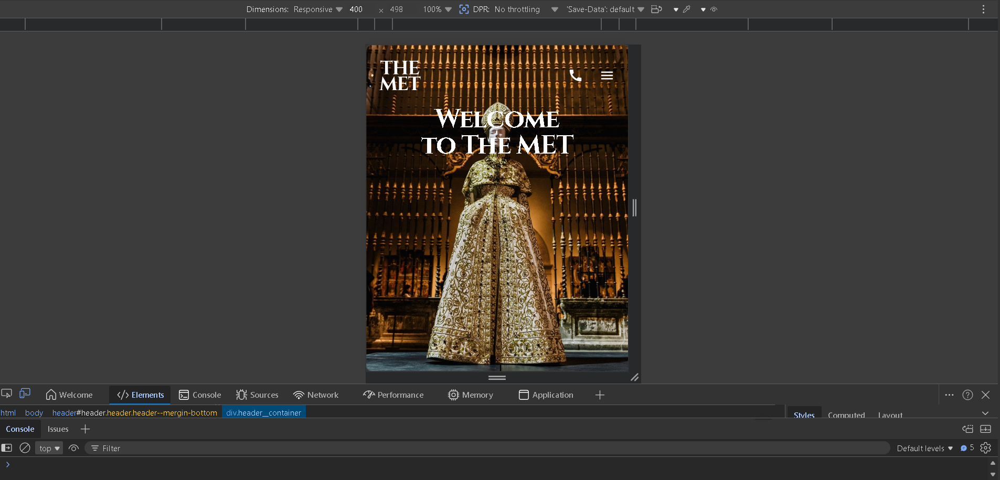

# 🏛️ The MET — Landing Page

Responsive landing page for The Metropolitan Museum of Art, built with HTML5 and SCSS. Clean, modern layout with full mobile support and smooth user interactions.

🔗 **Live Demo:** https://pavlolab.github.io/the-met/

---

## 🖼️ Preview

---

## 🚀 Features

- Fully responsive (320px → 1440px+)
- Clean and modern UI
- Mobile-friendly navigation (CSS burger menu)
- Smooth hover effects and transitions
- Semantic and accessible HTML
- Well-structured and maintainable code

---

## 💼 What I Can Do For You

- Convert Figma design to responsive HTML/CSS website  
- Build modern and clean landing pages  
- Create fully responsive layouts for all devices  
- Fix layout and CSS issues  

---

## 🛠️ Tech Stack

- HTML5  
- SCSS / CSS3  
- Flexbox & CSS Grid  

---

## 📌 About This Project

This project demonstrates my ability to take a Figma design and turn it into a pixel-perfect, responsive website with clean and scalable code.

---

## 📩 Contact

- GitHub: https://github.com/pavlolab  
- Email: pavlolab.studio@gmail.com